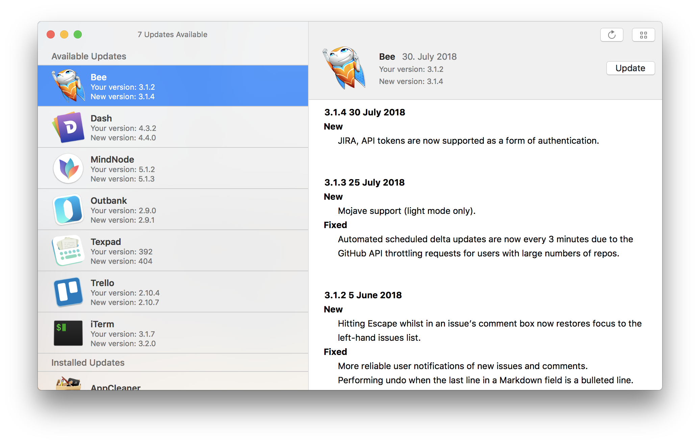

   
  <b>Latest</b>

 
=

This is a small utility app for macOS to check whether all Sparkle enabled apps are up to date.

The app offers very basic functionality.

• Check for updates of all apps in the /Applications/ folder

• Currently supports Mac App Store apps and all Sparkle enabled apps.

• View version description 

• Ability to open an app from within Latest

• Ability to open all apps at once

## Comming soon

• Automatic periodic checking with notifications

• Your ideas 🙃
